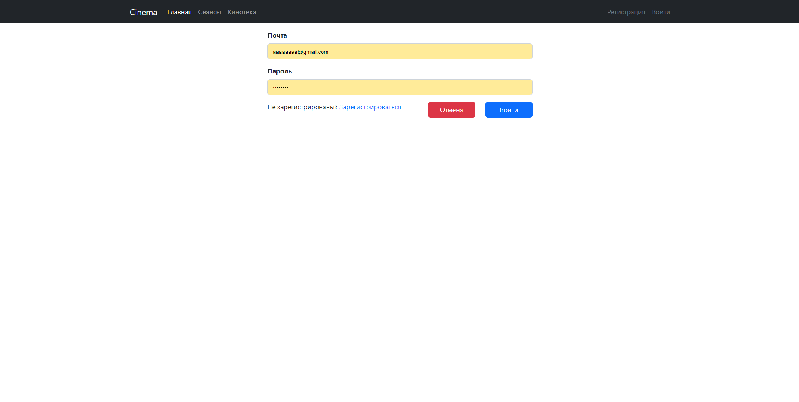
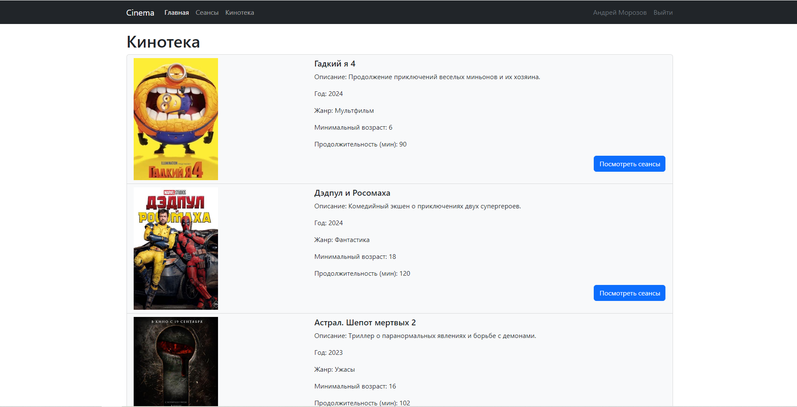
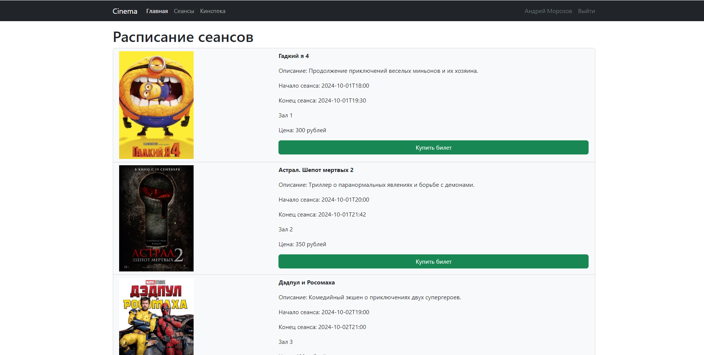

# job4j_cinema

## Описание проекта
Проект **job4j_cinema** — это веб-приложение, предназначенное для управления кинотеатром.
В этом приложении пользователи могут просматривать доступные сеансы, получать информацию о фильмах и ценах,
а также выбирать места в зале. Однако возможность покупки билетов доступна только авторизованным пользователям.

## Стек технологий
- **Java 21** - основной язык программирования
- **Spring Boot 2.7.6** - фреймворк для создания приложений
- **Thymeleaf** - шаблонизатор для построения HTML-страниц
- **Bootstrap** - это фреймворк для разработки адаптивных и мобильных веб-приложений
- **PostgreSQL 42.5.1** - БД
- **Liquibase 4.15.0** - инструмент для миграций базы данных
- **Maven 3.8** - система управления зависимостями
- **H2** - встроенная база данных для тестирования

## Требования к окружению
Для запуска проекта необходимо установить следующее ПО:
- **Java 21**
- **Maven 3.8**
- **PostgreSQL 42.5.1**

## Запуск проекта
1. Склонируйте репозиторий:
2. Создайте базу данных PostgreSQL :
3. Настройте доступ к базе данных в файле `application.properties`:
4. Соберите и запустите проект:

## Взаимодействие с приложением
### Web интерфейс
- Главная страница со списком доступных фильмов.
- Страница выбора сеансов и бронирования мест.
- Кинотека. Можно посмотреть все фильмы, которые показываются в нашем кинотеатре.

### API
Для доступа перейдите по адресу: `http://localhost:8080/index`

## Контакты
- Email: selove.jara@gmail.com
- Telegram: https://t.me/Moroz_koo

## Фото проекта

<table>
  <tr>
    <td></td>
    <td></td>
  </tr>
  <tr>
    <td></td>
    <td></td>
  </tr>
  <tr>
    <td></td>
    <td></td>
  </tr>
</table>